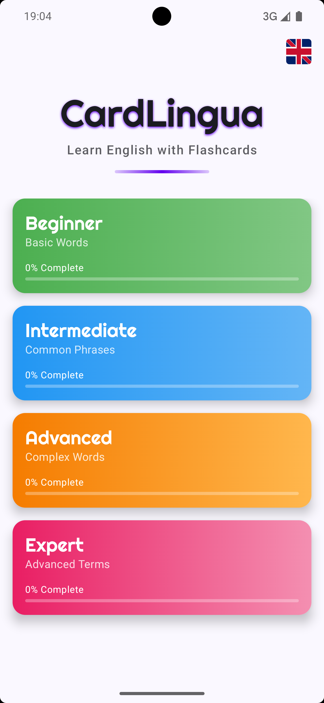
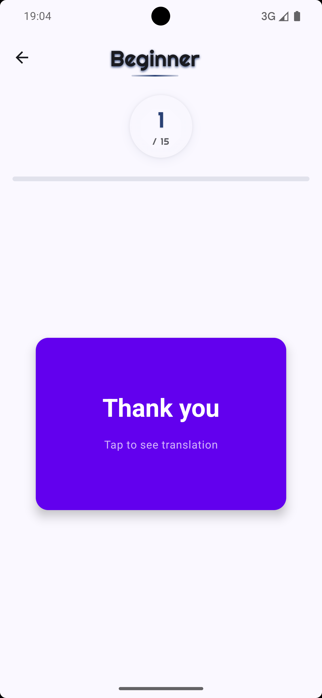
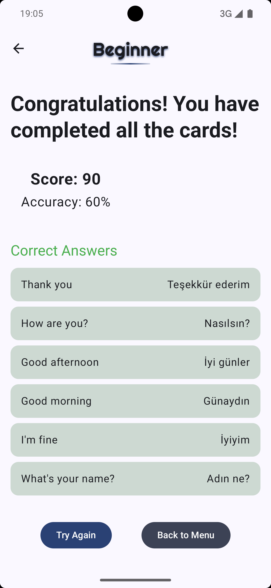
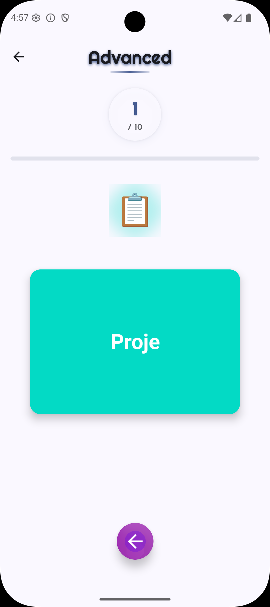
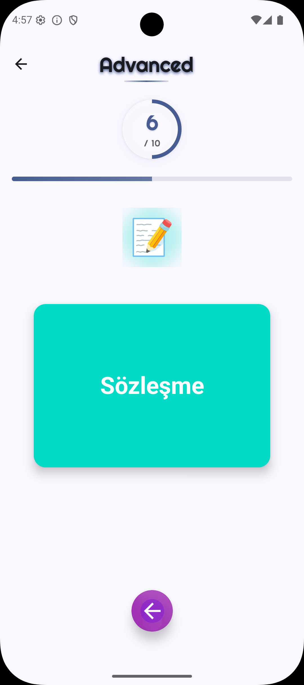
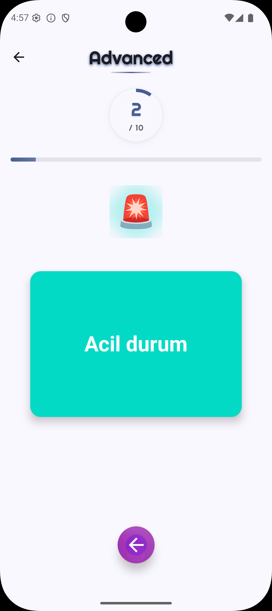

# CardLingua - Language Learning Flashcard App


CardLingua is a modern Android application designed to help users learn English through an interactive flashcard system. Built with Jetpack Compose and following Material 3 design principles, it offers an engaging way to expand vocabulary and improve language skills.

---

## 📸 Screenshots
Add screenshots here for a more visual README!








---

## ✨ Features

### Core Functionality
- **Flashcard Learning System**: Interactive card-based learning with swipe gestures
- **Progress Tracking**: Visual progress indicators for each category and difficulty level
- **Multi-Language Support**: Available in English and Turkish
- **Difficulty Levels**: Four progressive difficulty tiers
  - Beginner: Basic Words
  - Intermediate: Common Phrases
  - Advanced: Complex Words
  - Expert: Advanced Terms
- **Onboarding**: Friendly onboarding experience for new users
- **Game Modes**: Play, review, and track your progress

### Technical Features
- **Modern UI**: Built with Jetpack Compose and Material 3 design
- **Persistent Storage**: Progress and settings saved using DataStore
- **State Management**: ViewModel architecture with Kotlin Flows
- **Dependency Injection**: Hilt for dependency management
- **Clean Architecture**: Organized in domain, data, and presentation layers

---

## 🏗️ Project Structure

```text
CardLingua/
├── app/
│   ├── src/
│   │   └── main/
│   │       ├── java/com/remziakgoz/cardlingua/
│   │       │   ├── data/         # Data sources, repositories, managers
│   │       │   ├── domain/       # Core models
│   │       │   ├── di/           # Dependency injection (Hilt modules)
│   │       │   ├── presentation/ # UI screens, components, viewmodels
│   │       │   ├── ui/           # Theme and UI utilities
│   │       │   ├── CardLinguaApplication.kt
│   │       │   └── MainActivity.kt
│   │       ├── res/              # Resources (drawables, values, etc.)
│   │       └── AndroidManifest.xml
│   ├── build.gradle.kts
│   └── proguard-rules.pro
├── build.gradle.kts
├── settings.gradle.kts
└── README.md
```

---

## 🚀 Getting Started

### Prerequisites
- Android Studio Giraffe (or newer)
- Android SDK 24+
- Kotlin 1.8+

### Setup & Build
1. **Clone the repository:**
   ```sh
   git clone https://github.com/yourusername/CardLingua.git
   cd CardLingua
   ```
2. **Open in Android Studio**
3. **Build & Run:**
  - Click **Run** ▶️ or use `Shift+F10`.

> **Note:** No API keys or special configuration required. All data is local.

---

## 🤝 Contributing
Contributions, issues, and feature requests are welcome! Feel free to open an issue or submit a pull request.

---

## 📄 License
This project is licensed under the MIT License. See the [LICENSE](LICENSE) file for details.

---

## 👤 Author
- [Remzi Akgoz](https://github.com/remziakgoz)
